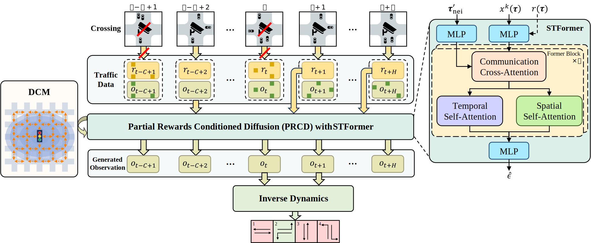

<p align="center">
    <h1 align="center">DiffLight: A Partial Rewards Conditioned Diffusion Model for Traffic Signal Control with Missing Data</h1>
</p>

[](https://www.pytorch.org)
[](https://arxiv.org/abs/2410.22938)
[](https://www.gnu.org/licenses/gpl-3.0.html)

This repo is the official code release for the NeurIPS 2024 conference paper:
<p align="center">&nbsp;<table><tr><td>
    <p align="center">
    <strong>
        <a href="https://nips.cc/virtual/2024/poster/96278">
            DiffLight: A Partial Rewards Conditioned Diffusion Model for Traffic Signal Control with Missing Data
        </a><br/>
    </strong>
    Hanyang Chen<sup>1,2</sup>, Yang Jiang<sup>1,2</sup>, Shengnan Guo<sup>1,2,*</sup>, Xiaowei Mao<sup>1,2</sup>, Youfang Lin<sup>1,2</sup>, Huaiyu Wan<sup>1,2</sup><br>
    <b>The Thirty-Eighth Annual Conference on Neural Information Processing Systems (NeurIPS 2024)</b><br>
    <sup>1</sup><em>School of Computer Science and Technology, Beijing Jiaotong University, China&nbsp;&nbsp;</em><br>
    <sup>2</sup><em>Beijing Key Laboratory of Traffic Data Analysis and Mining, Beijing, China &nbsp;&nbsp;</em><br>
    *Corresponding author.
    </p>
</td></tr></table>&nbsp;</p>

# 🧾 Introduction

In this paper, we study the problem of TSC with missing data in the offline setting. We introduce **DiffLight**, a novel conditional diffusion model for TSC under data-missing scenarios in the offline setting. Specifically, we integrate two essential sub-tasks, <em>i.e.</em>, traffic data imputation and decision-making, by leveraging a Partial Rewards Conditioned Diffusion (PRCD) model to prevent missing rewards from interfering with the learning process. Meanwhile, to effectively capture the spatial-temporal dependencies among intersections, we design a Spatial-Temporal transFormer (STFormer) architecture. In addition, we propose a Diffusion Communication Mechanism (DCM) to promote better communication and control performance under data-missing scenarios.

<p align="center">
  
</p>

Extensive experiments on five datasets with various data-missing scenarios demonstrate that DiffLight is an effective controller to address TSC with missing data.

# 💻 Repository Structure

- `checkpoints/`: Stores the trained models of DiffLight.
- `data/`: Contains datasets for different cities and traffic scenarios.
- `memory/`: Stores memories of the datasets for different data-missing scenarios.
- `models/`: Contains the implementation of DiffLight.
- `records/`: Stores the results and logs of different experiments.
- `utils/`: Utility scripts for data processing, configuration, and model evaluation.
- `run_difflight.py`: Main script to run the DiffLight algorithm.
- `summary.py`: Script to summarize and evaluate the results of the experiments.
- `requirements.txt`: List of dependencies required to run the project.

# 🛠️ Usage

## Prerequisites

1. Install Python 3.8 or higher.
2. Install the required dependencies by running:
    ```sh
    pip install -r requirements.txt
    ```
3. Install CityFlow by following the instructions [here](https://cityflow.readthedocs.io/en/latest/).

## Data Preparation

1. Download the memories of datasets from the following links:
    - [Hangzhou<sub>1</sub>](https://drive.google.com/file/d/1Wu8gkoy_lCrAci6D4lFIEX8SNIekVfye/view?usp=drive_link) (HZ<sub>1</sub>)
    - [Hangzhou<sub>2</sub>](https://drive.google.com/file/d/1BIu94hSC2jYOSqOnmJgwdXyoCXuEl1Cj/view?usp=drive_link) (HZ<sub>2</sub>)
    - [Jinan<sub>1</sub>](https://drive.google.com/file/d/1LPeqLpSBr2-tRjsrHc-Tx_Qan92bJgkp/view?usp=drive_link) (JN<sub>1</sub>)
    - [Jinan<sub>2</sub>](https://drive.google.com/file/d/1FD1ROf87xxAK9PjxEwVH176d4VJJBmQX/view?usp=drive_link) (JN<sub>2</sub>)
    - [Jinan<sub>3</sub>](https://drive.google.com/file/d/1_EE4nmb7okh338eCo-cmxeiNqUxGgYYW/view?usp=drive_link) (JN<sub>3</sub>)
2. Place the downloaded memories in the `memory/fourphase/` directory.
3. Unzip the memories using the following command:
    ```sh
    unzip memory/fourphase/[dataset].zip -d memory/fourphase/
    ```

## Running DiffLight

1. Run the DiffLight algorithm using the following command:
    ```sh
    python run_difflight.py -[dataset] -[pattern & rate]
    ```
    where `[dataset]` is the city name (e.g., `hangzhou_1`, `jinan_1`, `newyork`) and `[pattern & rate]` is the data-missing scenario (e.g., `rm_1`: random missing, `km_wn_1`: kriging missing w/ neighbors, `km_won_1`: kriging missing wo/ neighbors).
    
## Evaluating Results

1. After running the experiments, you can summarize and evaluate the results using:
    ```sh
    python summary.py
    ```

## Example Configuration

Here is an example for running the DiffLight algorithm on the Hangzhou dataset with random missing data:
```sh
python run_difflight.py -hangzhou_1 -rm_1
```

# 🙏 Acknowledgements

DiffLight is based on many open-source projects, including [Decision Diffuser](https://github.com/anuragajay/decision-diffuser), [Advanced-XLight](https://github.com/LiangZhang1996/Advanced_XLight), [CityFlow](https://github.com/cityflow-project/CityFlow), [CoLight](https://github.com/wingsweihua/colight) and [FRAP](https://github.com/gjzheng93/frap-pub). We would like to thank the authors for their contributions to the communities.

# 🏷️ License
DiffLight is licensed under the [GPLv3 License](https://www.gnu.org/licenses/gpl-3.0.html).

# 📝 Citation
If you find this work useful, please consider citing the following paper:

```
@article{chen2024difflight,
  title={DiffLight: A Partial Rewards Conditioned Diffusion Model for Traffic Signal Control with Missing Data},
  author={Chen, Hanyang and Jiang, Yang and Guo, Shengnan and Mao, Xiaowei and Lin, Youfang and Wan, Huaiyu},
  journal={Advances in Neural Information Processing Systems},
  year={2024}
}
```
